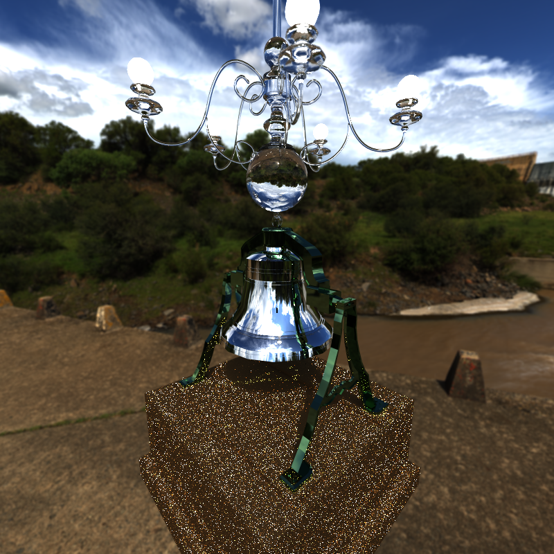

CUDA Path Tracer
================

**University of Pennsylvania, CIS 565: GPU Programming and Architecture, Project 3**

* Griffin Evans
* Tested on: Windows 11 Education, i9-12900F @ 2.40GHz 64.0GB, NVIDIA GeForce RTX 3090 (Levine 057 SIGLAB-02 (though marked 3 on the label))

## Setup instructions

The process of building the project is as follows:
1. Clone the project to a folder and navigate into it in Bash.
2. `mkdir build`
3. `cd build`
4. `cmake-gui ..`
5. Within CMake GUI, configure the project, selecting Visual Studio 17 2022 as the generator and x64 as the platform.
6. Select "generate".
7. Open the generated `.sln` file within the build folder in Visual Studio.
8. Build the project from the toolbar in Visual Studio.

## Features and analysis

### Materials—Diffusion, Reflection, and Refraction with Fresnel effects

Four categories of shaded material are included, along with an emissive material which applies a flat color value and terminates the ray. These are, as shown in order via the sphere in the above images, perfectly diffuse (bouncing incoming rays out in all directions), specular reflective (bouncing incoming rays exactly reflected about the surface normal), specular transmissive (refracting incoming rays into the material), and "glass" which uses both reflection and transmission/refraction. The specular models use the [Fresnel formula as adapted from PBRT](https://pbr-book.org/4ed/Reflection_Models/Dielectric_BSDF) to determine reflectance.

The materials in these scenes overall have little impact on the render time, but the scene does run slightly faster when only using diffuse as with only a single material there is less branching in the shading kernel and hence warps run more efficiently. The combined reflective+refractive material appeared to perform very slightly worse than the other specular materials, as it has an additional source of branching in that each ray intersecting the material picks randomly between reflecting or refracting, each of which has a separate branch (whereas the other specular materials only use one of these two branches). 

A potential further optimization is that these kernels could be restructured to combine more areas which use the same operations (for instance calling the `fresnelDielectricEval` only once by modifying input variables depending on which interaction is involved, rather than calling it separately in each branch). Another potential development related to these materials will be discussed in the later section on "Material Sorting".

This feature could be implemented very similarly on a CPU implementation, as nothing here particularly interacts with paralellism outside of the fact that we have multiple paths receiving shading at the same time. Because of that simulatenousness though the GPU is hence largely a benefit here, though the branching that occurs does make this particular implementation not totally optimized for the GPU.

### Antialiasing and physically-based depth-of-field

Antialiasing is achieved through a jittering of the coordinates in the image plane which we use to set the direction of our rays from the camera. Instead of picking a single consistent direction for each pixel in every frame, in each frame for each pixel we generate a random value and use that to sample a random location within that pixel's grid cell send the ray towards. By varying these samples each frame, as we accumulate pixel color we effectively average out the results from many possible ray directions, diminishing the aliasing effect that comes from picking a discrete point within a pixel. Note that this method takes advantage of the Monte Carlo nature of this path tracing algorithm—unlike in a rasterized approach, we don't need an increase in number of samples used or any sort of additional information stored to achieve an antialiasing effect.

Depth of field uses a similar technique to antialiasing, except now perturbing the origin of the ray rather than just the direction. By varying the starting location of the ray, we approximate over multiple frames the variety of locations that light hits on the surface of the lens. In order to replicate a circular lens, we hence choose points within a disk whose radius is our simulated lens' radius. We can also simulate an adjusting of focal distance by modifying the distance between this disk and the image plane. As the rays shot from the disk to the grid of the image plane converge only at a particular distance from the disk, this gives us an unblurred view of that particular distance, while becoming progressively more blurred further from that distance either towards or away from the camera.

This depth of field effect seems to have little to no impact on performance—in testing we see a very slight increase in the time taken to generate a ray, but as the variance that occurs test-to-test in the running of the other kernels is far greater than the difference observed here, it appears that this is not a significant change.

Because of this insignificant performance impact, it does not seem optimization is particularly necessary, but if one wanted to then one could potentially attempt to reduce the number of steps involved in the math or find a scheme to map values such that we need fewer calls to a random number generator than used here (e.g. rather than having four random numbers, could use one number and derive from it four lower-precision values).

Again this being on the GPU as opposed to the CPU is not particularly relevant for this feature, beyond that we can easily perform this sampling for many pixels at the same time.

### Motion blur

Motion blur here is achieved through the same concept of varying how we render each iteration, but rather than changing the ray we instead change the scene being rendered. Within the JSON files which store each scene, one can create an object using a series of keyframes with translation, rotation, and scale set at specified times rather than having a single constant set of transformations. In each iteration, we then randomly select a time between the first and last keyframes' times and perform linear interpolation of these translation, rotation, and scale values for each object for the set of keyframes about the specified time. The objects in the scene are transformed accordingly, and the color values we obtain of that transformed state are averaged with the values obtained for all of the other iterations as normal. This means that over a number of frames we approach taking an average of the image of all of the positions the objects had throughout the specified timespan. Hence we produce an image that blurs corresponding to the motion seen in the image—for example, the duck in the latter two images above is set to move right, up, and towards the camera across multiple keyframes, with later keyframes having their translations made closer together than the earlier keyframes. This means we produce a blur where the duck is barely visible on the lower left side, as it spent very little of the time there, and becomes more solid as it approaches the right side as it begins to slow down.

The performance impact of this effect is dependent on the amount and complexity of geometry that needs to be transformed. For a scene which simply moves a sphere, the performance impact is minimal, but when moving a more complex object it becomes much more significant. The duck used in the testing here is a glTF model which is loaded in as a set of triangles and has intersections tested using a BVH data structure (as will be discussed below). In order to render each frame, we hence need to construct a BVH corresponding to the positions of the duck's triangles in that particular frame (since the spatially-dependent data structure is no longer accurate if the duck has moved), which here requires us to apply the duck's transformation to each triangle it contains to find their updated positions before we can re-apply the BVH construction algorithm.

A likely means to improve the performance would thus be to implement some way to more smartly update the BVH. Since we're here only applying a simple series of transformations, it seems likely that we could often keep the same structure of BVH and simply update the coordinates used within it—for example, if we are only changing a model's translation, we could translate all of the coordinates within the BVH while keeping the same structure of volumes. Additional considerations may be necessary for other transformations (e.g. rotation would affect the bounding volumes' rotation) or for transforming only a part of the models used within a whole scene (currently, all triangle-based models share a single BVH in this implementation, meaning that if we have many models loaded and transform even one of them we would need to recalculate the BVH for all of them; hence a way to identify unaffected regions may be of benefit).

While this approach would be similarly applicable in a CPU-side path tracer, note that this is highly dependent on obtaining a very large number of samples in order to converge to a smoothly blurred image. Hence in contexts where we are not able to obtain so many frames this quickly we would potentially prefer an approach where we render at a single sample time but track some additional information about the object's motion about that frame (e.g. a buffer of motion directions and magnitudes) and apply some blur effect based on that, possibly as a post process as one may in real-time contexts.

### Arbitrary mesh rendering via glTF and BVH spatial data structure

Triangle data can be loaded in from .gltf and .glb files and used as surfaces in a scene, leveraging functions from the [tinygltf library](https://github.com/syoyo/tinygltf/). Since high-quality models involve an incredibly large number of triangles, we use the BVH (bounding volume hierarchy) spatial data structure to store the loaded triangles in a way that we can more efficiently iterate through when testing for ray intersections, rather than needing to check against every triangle in the scene per each ray.

The performance benefit of incorporating BVH is enormous. For the above image of a duck inside a box, even though the duck is a relatively simple asset compared to many of those used today, iterating without BVH is still roughly ten times slower than with BVH, and this difference would likely increase even further as we add more triangles to the scene.

This implementation however is only a relatively basic version of BVH, and hence many improvements to its performance are possible. An obvious instance of this is that the triangles currently are accessed in the intersection function through a separate array of triangle indices, which means we have additional memory reads occurring in each iteration that could be avoided by instead rearranging the array of triangles before it is passed to the GPU. The BVH is also constructed using a naïve method of dividing volumes, simply splitting along the longest axis of the bounding volume, which does not necessarily result in the most useful divisions of volumes when it comes to performing intersection tests with them. The code to initially construct the volumes is also rather under-optimized, which is not hugely an issue here as it's fine enough for the scenes tested we're looking mostly about the performance once we've actually started rendering the scene, but could become problematic especially if trying to apply the above motion blur effect to particularly complex models, as the time spent on building the BVH each frame would begin to signficiantly affect the render speed. Note also the construction is performed entirely on the CPU, so part of this improvement could involve translating relevant aspects to the GPU side.

### Environment mapping

Backgrounds are applied through tinting each ray which has no intersections and hence exits the scene, rather than simply setting them to black as they are terminated. The scene files can be set either to use a flat color, as in the blue shown above, or they can use an environment map, here a texture loaded from a .hdr image. When using a environment map, whenever a ray exits the scene we use its direction in order to sample a point on the surface of a sphere (with the direction corresponding to the normal out at that point), then tint the ray with the appropriate color of the texture mapped onto that sphere's surface. Through using an .hdr image which maps smoothly onto the surface of a sphere, we hence obtain a 360º depiction of an environment about and lighting our scene.

The aspect of our code which this feature effects is the shadeMaterial kernel, which in the case of a ray failing to intersect the scene performs the aforementioned mapping of sphere to UV coordinates and draws the color value from an array which we filled with data from the loaded image. For the non-image cases, the same code is actually run, but the array is only a single value long, containing the color that we have set as the background (defaulting to black (0,0,0)). While the same code is run however, we do see some worsening performance when using the environment map texture. This likely comes from the variety of memory read locations necessary to sample colors from the array, as we may have many rays simulatenously hitting very disparate regions of the environment map and hence loading in values spread far across the array. In the single-color case, while we still read from the array, we always are reading from the same location and hence we don't need that disparate memory access. It could also be that the compiler is smart enough to ignore the unnecessary mapping operations in the case where the later coordinate values are ensured to be 0 regardless, but if not, this would be an easy starting place for an optimization in the non-textured case. The textured case could probably be improved by figuring out a smarter structure for storing the color information—here the 2D texture is converted to a long 1D array, and hence points which are very adjacent to each other in one direction become strided.

This feature could again be achieved similarly on a CPU implementation, as it does not particularly rely on parallelism beyond the parallelism of our shading multiple paths at once.

### Stream Compaction and Material Sorting

Stream compaction is applied in order to only invoke our kernels for paths which have not already terminated (i.e. those that have not exited the scene, hit lights, or run out of bounces). We do this by partitioning the array of paths based on whether their stored `.remainingBounces` value is greater than 0, and we set this value to 0 in the other kernels whenever we find a condition that should terminate the path, otherwise decrementing it by 1 each bounce. The paths which fulfil this condition are used in the next depth step, while the other paths are kept at the end of the array and ignored until the iteration is finished. Once there are no paths with bounces left, we use the colors stored in all of the paths to update the state of our rendered image. We also have an option to enable sorting of the path array by what material the path is intersecting with, such that similarly behaving rays will be more so in the same blocks and warps.

These features add overhead to each iteartion however, which for relatively simple scenes can dominate the running time such that despite getting faster behavior in ther intersection and shading kernels we take longer overall. This is especially true for the material sorting, which adds about twice the time as using compaction does. Note though that as we get into later steps of each iteration we see more and more benefit from the compaction, as the number of rays reduces more and more compared to the constant amount used by the non-compacting approach, as can be seen in the above chart comparing the 5th and 6th steps of an iteration, where the compacting approach begins to see faster performance even when combining both compaction and intersection times.

In a closed scene we see very little change between methods, as the ray very rarely terminates. The complex open scene shown here however showcases very odd behavior, as it appears to perform significantly worse with stream compaction despite smaller scenes seeing benefits from it. My best estimation is that this has to do with the array being rearranged, somehow causing more erratic behavior between the paths adjacent to each other in memory.

### Russian roulette path termination

We add an additional means for paths to terminate: when the magnitude of its color is below some threshold, we give it a random chance to terminate early, and if it doesn't then we multiply its color value. this results in the results appearing the same on average, while spending less time on paths that don't particularly impact the result. The benefits of this grow as the threshold is increased, here showing a noticeable improvement when tried on colors less than 0.1 in magnitude, with each example here using a 25% chance to terminate.

## Third Party Sources
I made use of the [tinygltf library](https://github.com/syoyo/tinygltf/) as suggested in order to load in model data from glTF files. I feel I should note I did look at Ruipeng Wang's code from last year in regards to using the aforementioned tinygltf library when I was talking with him in office hours about trying to fix a bug I was having with loading the vertex indices.

I also referenced [the article "How to build a BVH" by Jacco Bikker](https://jacco.ompf2.com/2022/04/13/how-to-build-a-bvh-part-1-basics/) in order to understand how to implement the BVH construction and traversal algorithms. Similarly [Physically Based Rendering: From Theory To Implementation (4ed), by Matt Pharr, Wenzel Jakob, and Greg Humphreys](https://pbr-book.org/4ed/) was referenced for information on refraction and depth of field.

Reused timer code from Stream Compaction project for performance testing, due to having issues running Nsight on the machine I was using.

Environment map textures used are [Dam Wall, by Dimitrios Savva and Jarod Guest](https://polyhaven.com/a/dam_wall), and [Industrial Sunset (Pure Sky), by Sergej Majboroda and Jarod Guest](https://polyhaven.com/a/industrial_sunset_puresky), both from Poly Haven.

All glTF files used were either created by me using Maya (those in the `scenes/glTF` folder) or obtained from [the Khronos Group's sample asset repository](https://github.com/KhronosGroup/glTF-Sample-Assets) (those in the `scenes/glTF-Samples` folder):

"A Beautiful Game" Credit:
© 2020, ASWF. CC BY 4.0 International
- MaterialX Project for Original model
© 2022, Ed Mackey. CC BY 4.0 International
- Ed Mackey for Conversion to glTF

"Avocado" Credit:
© 2017, Public. CC0 1.0 Universal
- Microsoft for Everything

"Box" Credit:
© 2017, Cesium. CC BY 4.0 International
- Cesium for Everything

"Duck" Credit:
© 2006, Sony. SCEA Shared Source License, Version 1.0
- Sony for Everything

"Fox" Credit:
© 2014, Public. CC0 1.0 Universal
- PixelMannen for Model
© 2014, tomkranis. CC BY 4.0 International
- tomkranis for Rigging & Animation
© 2017, @AsoboStudio and @scurest. CC BY 4.0 International
- @AsoboStudio and @scurest for Conversion to glTF

"Triangle" Credit:
© 2017, Public. CC0 1.0 Universal
- Marco Hutter (https://github.com/javagl/) for Everything
