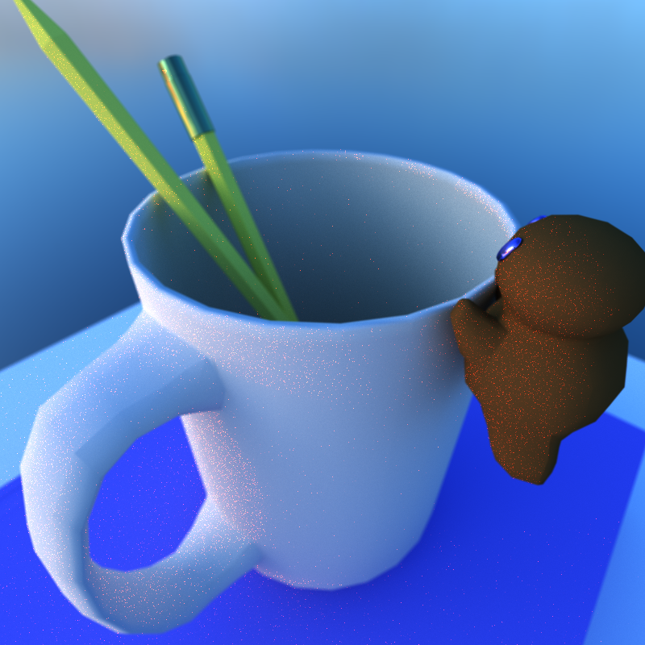
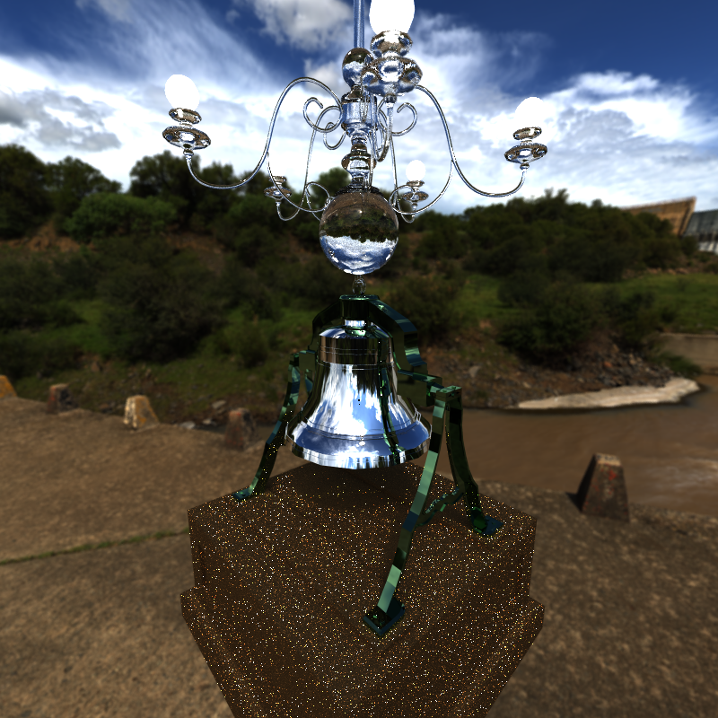
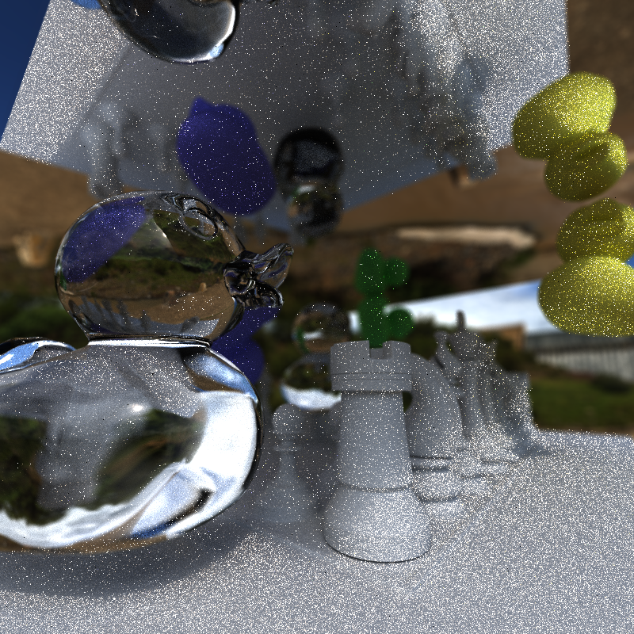
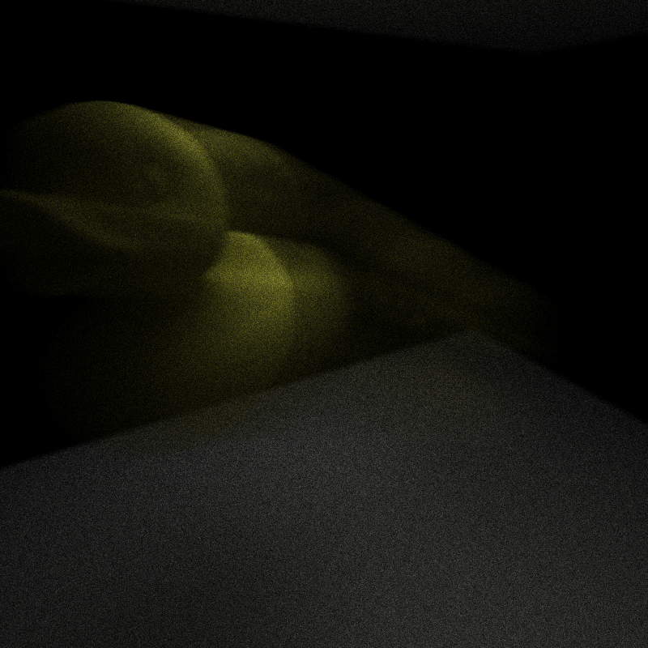

CUDA Path Tracer
================

**University of Pennsylvania, CIS 565: GPU Programming and Architecture, Project 3**

* (TODO) YOUR NAME HERE
* Tested on: (TODO) Windows 22, i7-2222 @ 2.22GHz 22GB, GTX 222 222MB (Moore 2222 Lab)

## Features and Analysis

TODO plots for each once done with tests on lab desktop

### Refraction with Fresnel effects
### Physically-based depth-of-field
### Motion blur

### Russian roulette path termination
### Arbitrary mesh rendering via glTF
### BVH spatial data structure
### Environment mapping

## Third Party Sources
I made use of the [tinygltf library](https://github.com/syoyo/tinygltf/) as suggested in order to load in model data from glTF files. I feel I should note I did look at Ruipeng Wang's code from last year in regards to using the aforementioned tinygltf library when I was talking with him in office hours about trying to fix a bug I was having with loading the vertex indices.

I also referenced [the article "How to build a BVH" by Jacco Bikker](https://jacco.ompf2.com/2022/04/13/how-to-build-a-bvh-part-1-basics/) in order to understand how to implement the BVH construction and traversal algorithms.

Reused timer code from Stream Compaction project for performance testing, due to having issues running Nsight on the machine I was using.

Environment map textures used are [Dam Wall, by Dimitrios Savva and Jarod Guest](https://polyhaven.com/a/dam_wall), and [Industrial Sunset (Pure Sky), by Sergej Majboroda and Jarod Guest](https://polyhaven.com/a/industrial_sunset_puresky), both from Poly Haven.

All glTF files used were either created by me using Maya (those in the `scenes/glTF` folder) or obtained from [the Khronos Group's sample asset repository](https://github.com/KhronosGroup/glTF-Sample-Assets) (those in the `scenes/glTF-Samples` folder):

"A Beautiful Game" Credit:
© 2020, ASWF. CC BY 4.0 International
- MaterialX Project for Original model
© 2022, Ed Mackey. CC BY 4.0 International
- Ed Mackey for Conversion to glTF

"Avocado" Credit:
© 2017, Public. CC0 1.0 Universal
- Microsoft for Everything

"Box" Credit:
© 2017, Cesium. CC BY 4.0 International
- Cesium for Everything

"Duck" Credit:
© 2006, Sony. SCEA Shared Source License, Version 1.0
- Sony for Everything

"Fox" Credit:
© 2014, Public. CC0 1.0 Universal
- PixelMannen for Model
© 2014, tomkranis. CC BY 4.0 International
- tomkranis for Rigging & Animation
© 2017, @AsoboStudio and @scurest. CC BY 4.0 International
- @AsoboStudio and @scurest for Conversion to glTF

"Triangle" Credit:
© 2017, Public. CC0 1.0 Universal
- Marco Hutter (https://github.com/javagl/) for Everything
